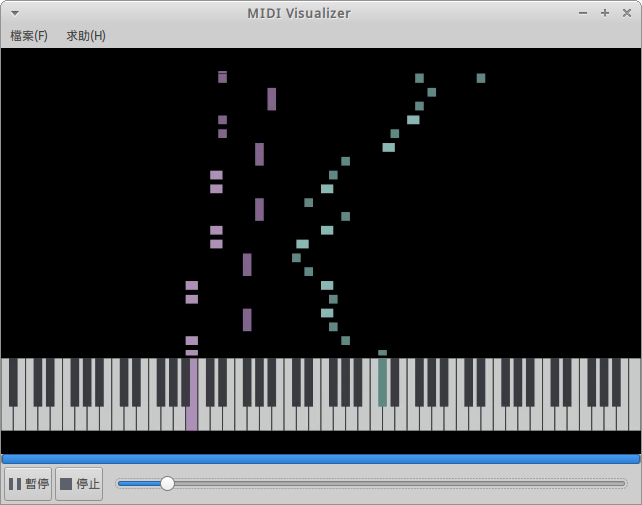
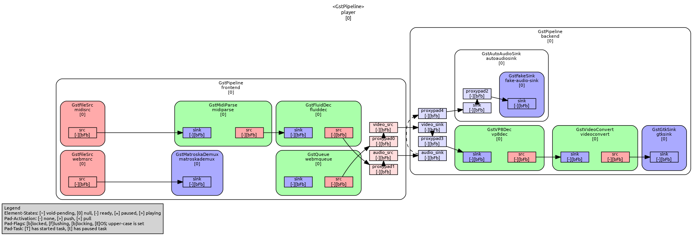
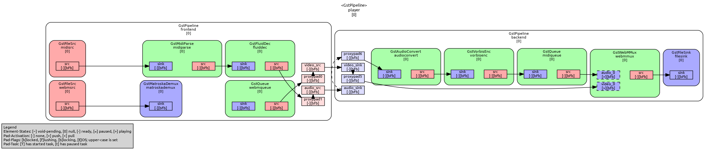

# MIDI Visualizer

Gtk application to visualize MIDI file as piano tutorial videos. A project for
the course Multimedium Computing Environment (National Taiwan University, 2018
Spring).



## Build Environment

### Ubuntu

```bash
$ sudo apt install python3-venv python3-pip gstreamer1.0-plugins-bad ffmpeg libffi-dev
$ make start
```

The Makefile script downloads a soundfont (249 MB) and creates virtualenv environment.

### Windows

1. Install [Python 3.4](https://www.python.org/downloads/release/python-340/)
    - Noted that PyGObject for Windows do not support Python 3.5 or above
2. Install [PyGObject for Windows](https://sourceforge.net/projects/pygobjectwin32/)
    1. Choose these items in GNOME libraries:
        - Base packages
        - Gst-plugins
        - Gst-plugins-extra
        - Gst-plugins-more
        - Gstreamer
        - GTK+
        - JSON-glib
    2. Choose none in non-GNOME libraries
    3. Choose none in development packages
3. Open the `cmd.exe` to prepare for installing dependencies
    ```batch
    > python -m pip install --upgrade pip
    > pip install requests pycparser
    ```
4. Download wheel packages from [Unofficial Windows Binaries for Python Extension Packages](https://www.lfd.uci.edu/~gohlke/pythonlibs)
    - `cffi‑1.11.5‑cp34‑cp34m‑win_amd64.whl`
    - `moviepy‑0.2.3.4‑py2.py3‑none‑any.whl`
5. Open the `cmd.exe` again to install dependencies
    ```batch
    > pip install cffi‑1.11.5‑cp34‑cp34m‑win_amd64.whl
    > pip install moviepy‑0.2.3.4‑py2.py3‑none‑any.whl
    > pip install gizeh mido intervaltree
    ```
6. Open `C:\Python34\Lib\site-packages\cairocffi\__init__.py`
    - Change line 41 and save
        ```diff
        - cairo = dlopen(ffi, 'cairo', 'cairo-2')
        + cairo = dlopen(ffi, 'cairo', 'cairo-2', 'cairo-gobject-2')
        ```
7. Download soundfont from [musical-artifacts.com](https://musical-artifacts.com/artifacts/433), save it to `soundfont/touhou.sf2`
8. Execute `python3 main.py`

## Details Explanation

### Pipeline for Playing Video


### Pipeline for Saving Video


## Credits
1. Gtk framework
    - [Gtk+](https://www.gtk.org/): a multi-platform toolkit for creating graphical user interfaces
    - [Gstreamer](https://gstreamer.freedesktop.org/): a library for constructing graphs of media-handling components
2. Dependent packages
    - [gizeh](https://github.com/Zulko/gizeh): a Python library for vector graphics
    - [moviepy](https://github.com/Zulko/moviepy): a Python library for video editing
    - [mido](https://github.com/olemb/mido/): a library for working with MIDI messages and ports
    - [intervaltree](https://github.com/chaimleib/intervaltree): a mutable, self-balancing interval tree
3. Resources
    - `midi/charming-domination.mid` from [Chris33711](https://youtu.be/psOjoZmGLnA)
    - `midi/at-the-end-of-the-spring.mid` from [Chris33711](https://youtu.be/I3TRDQYr8xI)
    - `soundfont/Touhou.sf2` from [Musical Artifacts](https://musical-artifacts.com/artifacts/433)
